* Table of Contents
{:toc}

# Rocker Switch Wiring Assembly

**Number to build: 1**

**Parts**

0. 1 - 2-pin Female Smaller JST Uh-oh Connector
0. 1 - 3-pin Rocker Switch
0. 2 - 2-pin Male Red JST Battery Connector
0. 2 - 1/2" Heat Shrink Tubing

**Tools**

0. Wire Strippers
0. Wire Cutters
0. Soldering Iron

**Instructions**

0. (2) Cut red JST battery connector wires to 3.5" and strip 1/4" from ends.
0. (2) Untwist 1 JST wire 1" and strip 1/4" from end.
0. (2) Cut 1/2" heat shrink tubing

    {:.sq_img_300}
    

     

0. (2) Twist all 3 black wires together, insert through heat shrink tube.
0. (2) Twist all 3 red wires together, insert through heat shrink tube.

    {:.sq_img_300}
    

     

0. Solder black wires to middle pin of switch.
0. Solder red wires to pin on "O" side of switch.
  * **Pro tip:** Solder wires together first, then solder to lead of the switch.
0. Heat shrink the tubing around solder points.

    {:.sq_img_300}
    

     

# DC Plug Wiring Assembly

**Number to build: 1**

**Parts**

0. 2 - 2-pin Female Larger JST Volt Reg Connector
0. 1 - DC Barrel Plug
0. 1 - 2-pin Female Smaller JST Uh-oh Connector

**Tools**

0. Wire Strippers
0. Wire Cutters
0. Small Screw Driver

**Instructions**

0. Strip all other JST wires 1/4" from end.
0. Twist all 3 black wires together and screw into negative terminal of DC plug.
0. Twist all 3 red wires together and screw into positive terminal of DC plug.

    {:.sq_img_300}
    

     

# Power Supply Assembly

**Number to build: 1**

**Parts**

0. 1 - Rocker Switch Wiring Assembly
0. 1 - DC Plug Wiring Assembly
0. 1 - Uh-oh battery indicator Board Kit

**Tools**

0. Soldering Iron
0. Solder
0. Small Screw Driver

**Instructions**

0. Solder on all components to Uh-oh battery indicator board.
0. Adjust Uh-oh battery indicator board to 11V and label.
0. Adjust one voltage regulator to 5V and label.
0. Adjust one voltage regulator to 9V and label.
0. Plug rocker switch wiring assembly into "Batt" on Uh-oh battery indicator board.
0. Plug DC plug wiring assembly into "Sys" on Uh-oh battery indicator board.
0. Plug large JST plugs into "IN" on voltage regulators.

    {:.sq_img_300}
    

     

# IR Sensor Assembly

**Number to build: 5**

**Parts**

0. 1 - IR Sensor
0. 2 - 1/4" 4-40 Screws
0. 2 - 4-40 Angle Brackets

**Tools**

0. Small Screw Driver

**Instructions**

0. (2) Screw the screw through IR sensor hole into threaded angle bracket hole with the angle bracket on the backside of the IR sensor.

    {:.sq_img_300}
    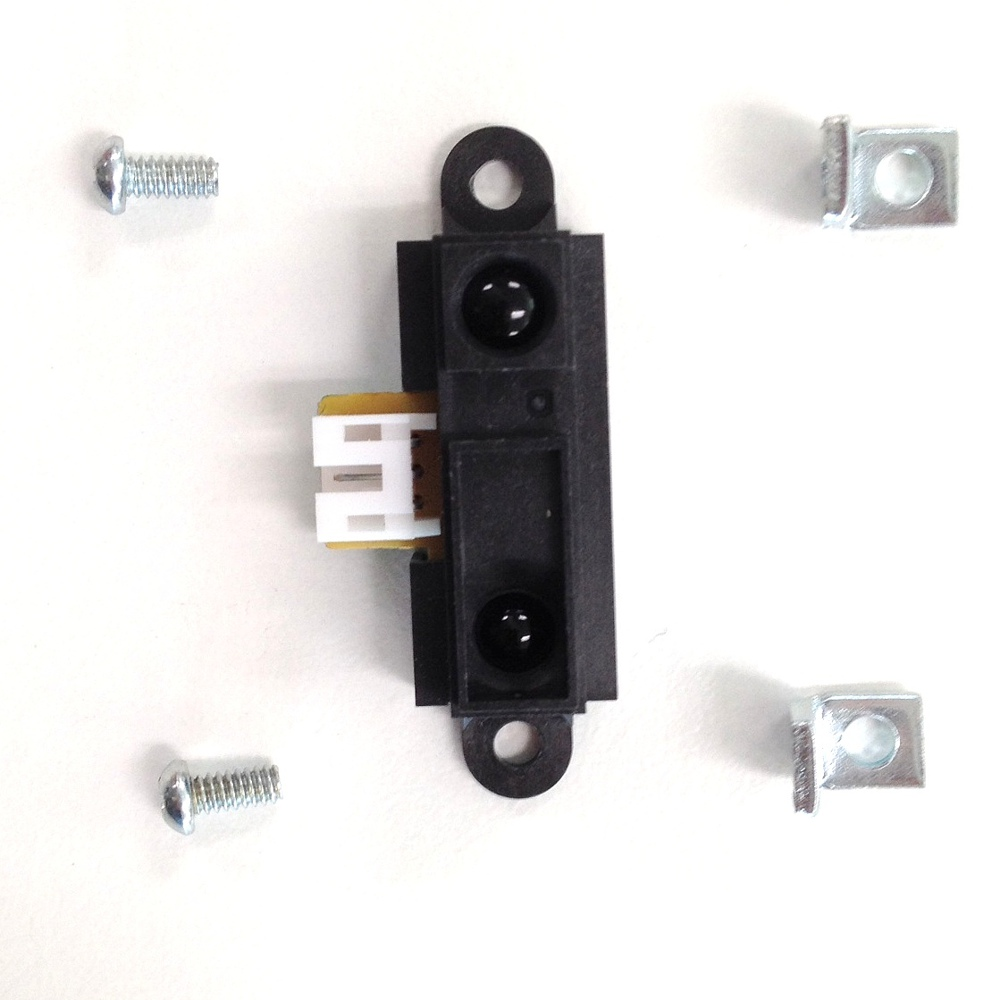

    {:.sq_img_300}
    
    **IR Sensor Assembly**

     

# Encoder Cable Assembly

**Number to build: 2**

**Parts**

0. 1 - Encoder Ribbon Cable
0. 5 - Female Molex Crimp Pins
0. 1 - 5-pin Molex Header
0. 2 - 1x2-pin 0.1" Crimp Connector Housing
0. 1 - 1x1-pin 0.1" Crimp Connector Housing
0. 5 - 0.1" Male Crimp Pins

**Tools**

0. Wire Strippers
0. Wire Cutters
0. Crimpers
0. Needle Nose Pliers

**Instructions**

0. Separate 3/4" of the ribbon cable in to individual wires.
0. Strip 1/8" of insulation from each write and twist ends they are no frayed.
0. Crimp female Molex crimp pin to each wire.
  * **Note:** Make sure to crimp pin in correct orientation.**

    {:.sq_img_300}
    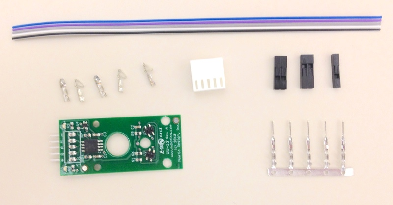

    {:.sq_img_300}
    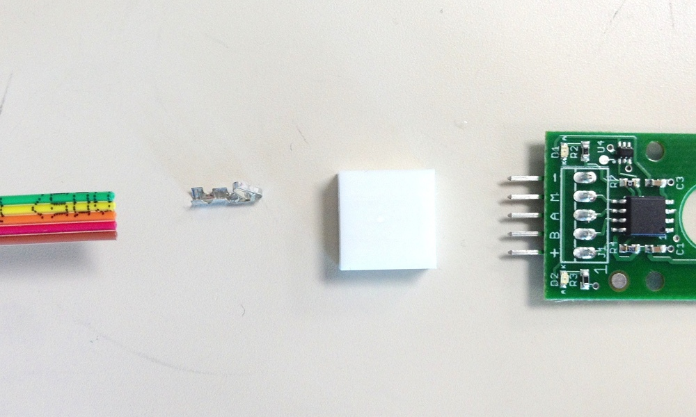

     

0. Separate 3/4" of the other end of the ribbon cable into individual wires.
0. Strip 1/8" of insulation from each wire and twist ends so they are not frayed.
0. Crimp 0.1" male crimp pin to each wire.
0. Insert white & gray or yellow & orange wires into 1x2 0.1" crimp connector housing.
0. Insert black & blue or green & brown wire into 1x2 0.1" crimp connector housing.
0. Insert purple or red into 1x1 0.1" crimp connector housing.

    {:.sq_img_300}
    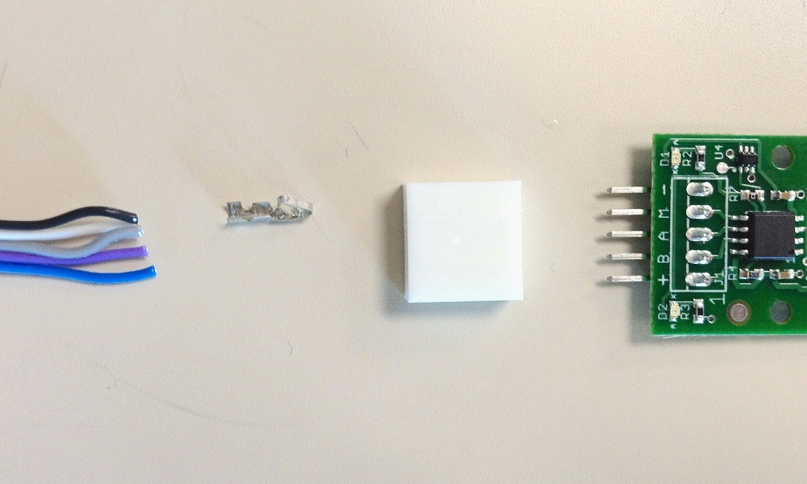

     

# IR Cable Assembly

**Number to build: 5**

**Parts**

0. 1 - 3-pin Female JST IR Sensor Connector
0. 1 - 1x2-pin 0.1" Crimp Connector Housing
0. 1 - 1x1-pin 0.1" Crimp Connector Housing
0. 3 - 0.1" Male Crimp Pins

**Tools**

0. Wire Strippers
0. Wire Cutters
0. Crimpers
0. Needle Nose Pliers

**Instructions**

0. Cut connector wires to 7" and strip off 1/8" of insulation from the ends.
0. Crimp on crimp pins to each wire end.
0. Insert red and black wire into 1x2-pin connector housing.
0. Insert white wire into 1x1-pin connector housing.

    {:.sq_img_300}
    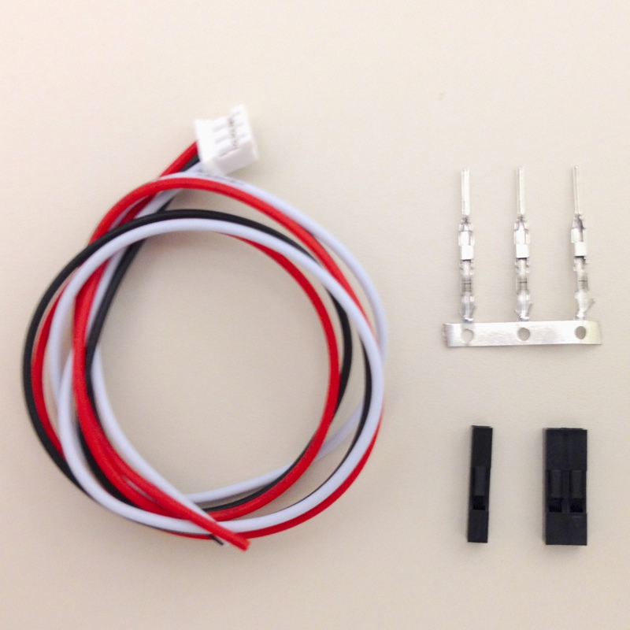

     

# Logic Level Converter Assembly

**Number to build: 1**

**Parts**

0. 1 - Logic Level Converter Board
0. 2 - 6-pin Male Breakaway Header Pins

**Tools**

0. Soldering Iron
0. Solder

**Instructions**

0. Solder header pins to board.
  * **Note:** The black portion of the header pins sits flush against the bottom of the board.
  * **Pro Tip:** Place header pins into a breadboard for easy soldering.

# Breadboard Assembly

**Parts**

0. 1 - Logic Level Converter Assembly
0. 1 - Breadboard
0. 1 - H-Bridge
0. 6 - 4/10" Breadboard Jumper Wires (orange)
0. 4 - 5/10" Breadboard Jumper Wires (yellow)
0. 5 - 20k Ohm Resistors (red-black-orange-gold)
0. 5 - 10k Ohm Resistors (brown-black-orange-gold)

**Instructions**

0. Instal all components onto breadboard as shown in the image.

    {:.sq_img_300}
    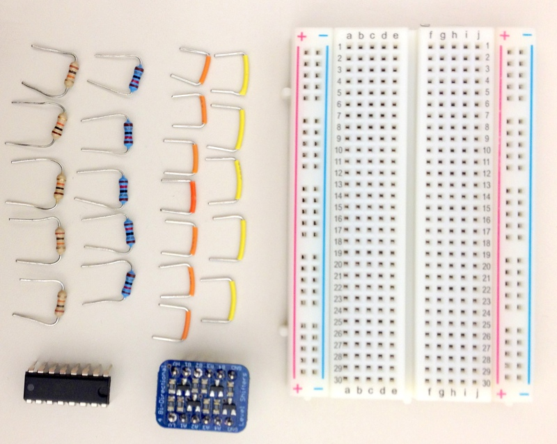

     

# Motor-Encoder Assembly

**Number to build: 2**

**Parts**

0. 1 - Encoder Disc Sticker
0. 1 - Speed Board Disc
0. 1 - Wheel Encoder
0. 1 - Motor

**Instructions**

0. Stick encoder disc sticker onto wheel encoder disc.
  * **Note:** Make sure to place directly in the center of the disc!
0. Fit wheel encoder onto motor using round notch as an alignment guide.
0. Slide disc with sticker on to motor axle with the sticker facing the encoder.

    {:.sq_img_300}
    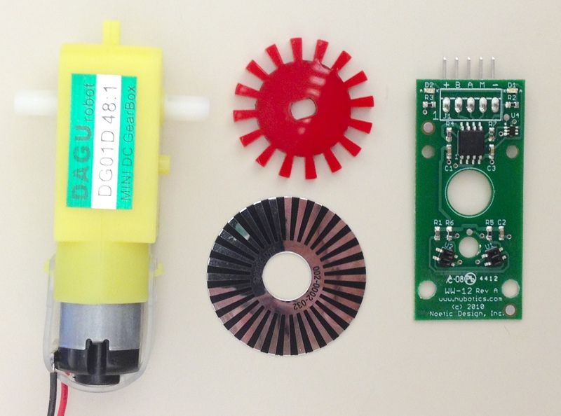

    {:.sq_img_300}
    

     

# Bottom Chassis With Motors Assembly

**Number to build: 1**

**Parts**

0. 2 - Motor-Encoder Assembly
0. 1 - Bottom Chassis Plate
0. 4 - Motor Holders (2 modified, 2 normal)
0. 4 - M3*30 Screw
0. 4 - M3 Nut

**Tools**

0. Small Screw Driver

**Instructions**

0. Place modified motor holders through slots in the bottom chassis plate, orientated such that modified edge of motor holders are on the front side of chassis (rounded edge).

    {:.sq_img_300}
    

     

0. Install motor-encoder assembly with black wires of motors away from chassis.

    {:.sq_img_300}
    

     

# Bottom Chassis With Wheels Assembly

**Parts**

0. 1 - Bottom Chassis With Motors Assembly
0. 2 - Wheel
0. 1 - Omni Wheel
0. 4 - M3*6 Screw
0. 2 - L25 Spacer

**Tools**

0. Small Screw Driver

**Instructions**

0. Slide wheels onto motor axels.
0. Screw two L25 spacers onto the omni wheel.
0. Screw omni with spacers onto the bottom back (flat edge) of chassis assembly.

    {:.sq_img_300}
    

     

#

# Bottom Chassis With Voltage Regulators

**Number to build: 1**

**Parts**

0. 1 - Bottom Chassis With Motors Assembly
0. 2 - Voltage Regulators
0. 4 - 1/2" 4-40 Screw
0. 8 - 4-40 Nut

**Tools**

0. Small Screw Driver

**Instructions**

0. Add voltage regulators to top front of chassis assembly using screws and nuts. With each screw use one nut as a spacer between the voltage regulator and the chassis and one nut to secure the screw from the bottom of the chassis.

    {:.sq_img_300}
    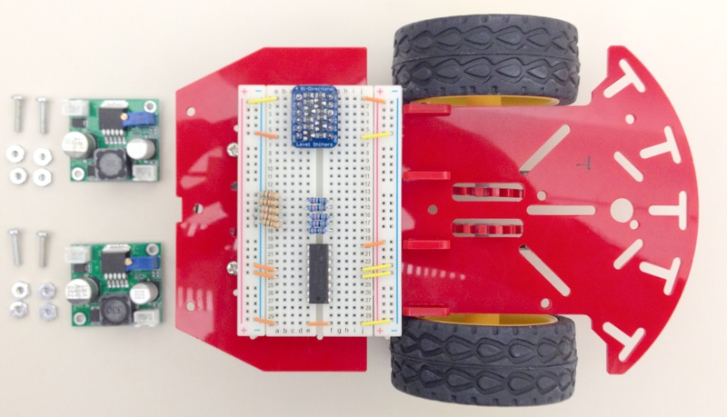

     

# Bottom Chassis With IR Sensors Assembly

**Number to build: 1**

**Parts**

0. 1 - Bottom Chassis With Voltage Regulators
0. 1 - Breadboard Assembly
0. 2 - IR Sensor Assembly
0. 4 - 1/2" 4-40 Screw
0. 4 - 4-40 Nut
0. 4 - L25 Spacer
0. 4 - M3 Nut

**Tools**

0. Small Screw Driver

**Instructions**

0. Add IR sensors to front of bottom chassis.
0. Stick on breadboard to top of bottom chassis. Make sure to have it flush against the motor mounts.
0. Mount L25 spacers to four corners of bottom chassis.

    {:.sq_img_300}
    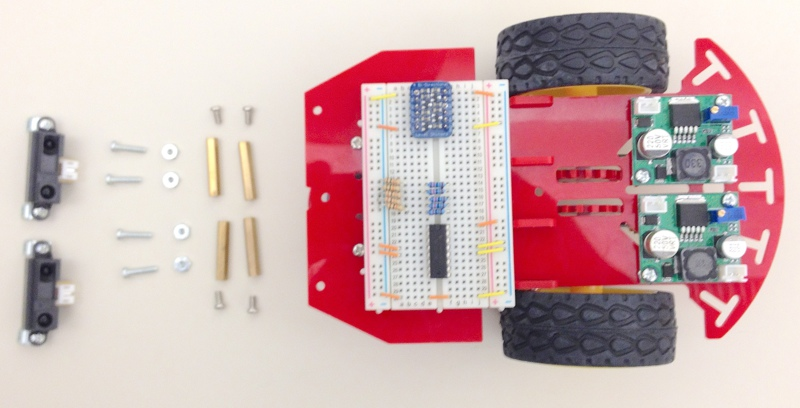

     

# Top Chassis Plate Assembly

**Number to build: 1**

**Parts**

0. 3 - IR Sensor Assembly
0. 1 - Power Supply Assembly
0. 1 - Top Chassis Plate
0. 8 - 1/2" 4-40 Screw
0. 10 - 4-40 Nut
0. 3 - Zip Ties
0. 4 - L10 Spacer
0. 4 - M3 Screw

**Tools**

0. Small Screw Driver

**Instructions**

0. Add L10 spacers to top plate.

    {:.sq_img_300}
    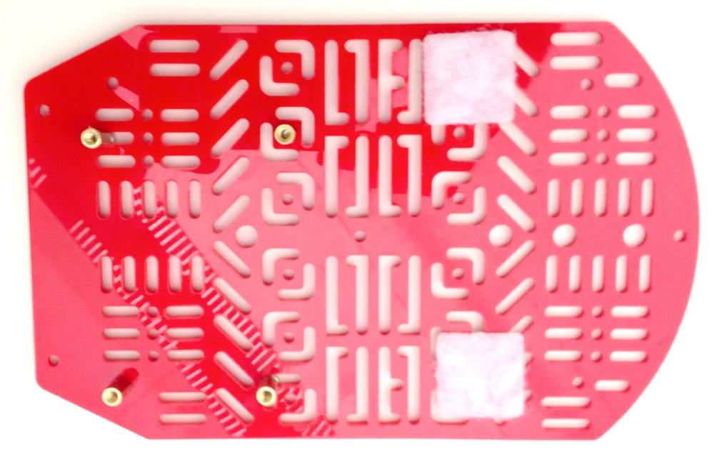

    {:.sq_img_300}
    

     

0. Add Uh-oh board to top plate.
0. Zip tie on switch and DC plug to front of plate.

    {:.sq_img_300}
    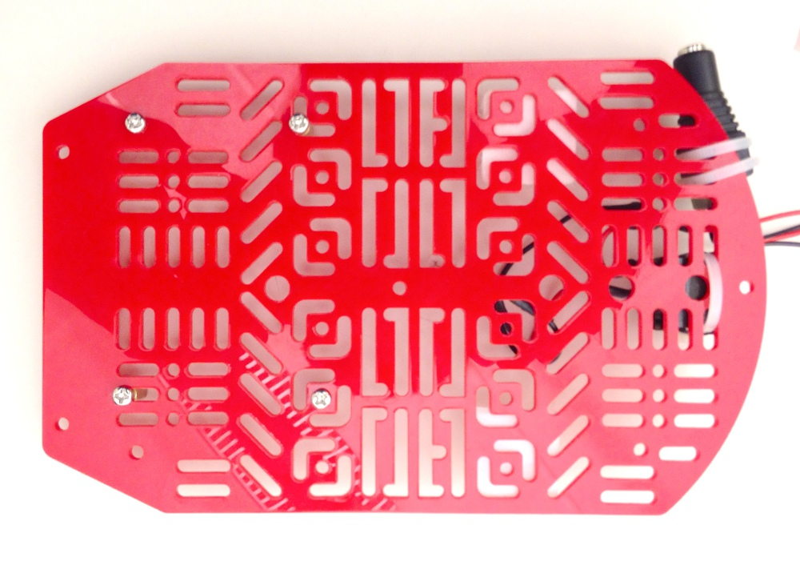

     

0. Add three IR sensors assemblies to top of plate.

    {:.sq_img_300}
    

    {:.sq_img_300}
    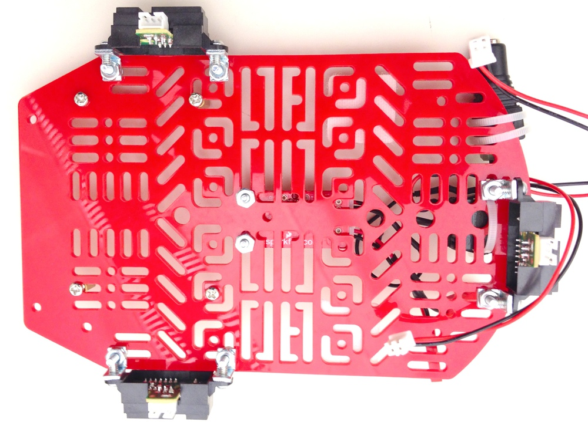

     

# Top Chassis Plate With BBB Assembly

**Number to build: 1**

**Parts**
0. Top Chassis Plate Assembly
0. BeagleBone Black
0. 4 - M3 Screw

**Tools**

0. Small Screw Driver

**Instructions**

0. Attach BeagleBone Black to top plate with Ethernet port sticking out to the right.

# QuickBot Assembly

**Number to build: 1**

**Parts**

0. 1 - Bottom Chassis With IR Sensors Assembly
0. 1 -Top Chassis Plate With BBB Assembly
0. 4 - M3 Screw

**Tools**

0. Small Screw Driver

**Instructions**

0. Attach top plate assembly to bottom plate assembly.

    {:.sq_img_300}
    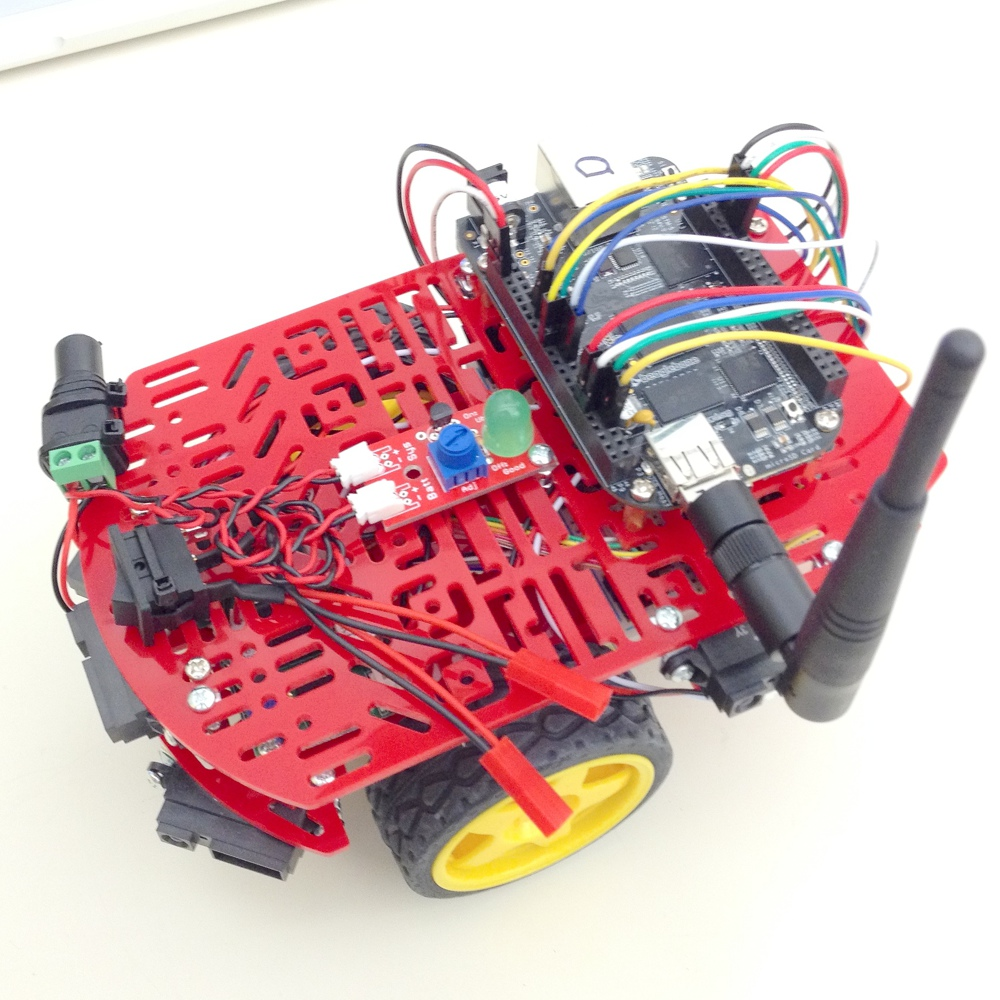

     

<noscript>Please enable JavaScript to view the <a href="http://disqus.com/?ref_noscript">comments powered by Disqus.</a></noscript>
<a href="http://disqus.com" class="dsq-brlink">comments powered by Disqus</a>

