* Table of Contents
{:toc}

<!--  -->

# 1. Rocker Switch Wiring Assembly

**Number to build: 1**

**Parts**

0. 2 - 2-pin Female Red JST Battery Connector
0. 1 - 2-pin Female 2mm-pitch JST Uh-oh Connector
0. 1 - 3-pin Rocker Switch
0. 3 - 1/2" Heat Shrink Tubing

{:.img_width_300}
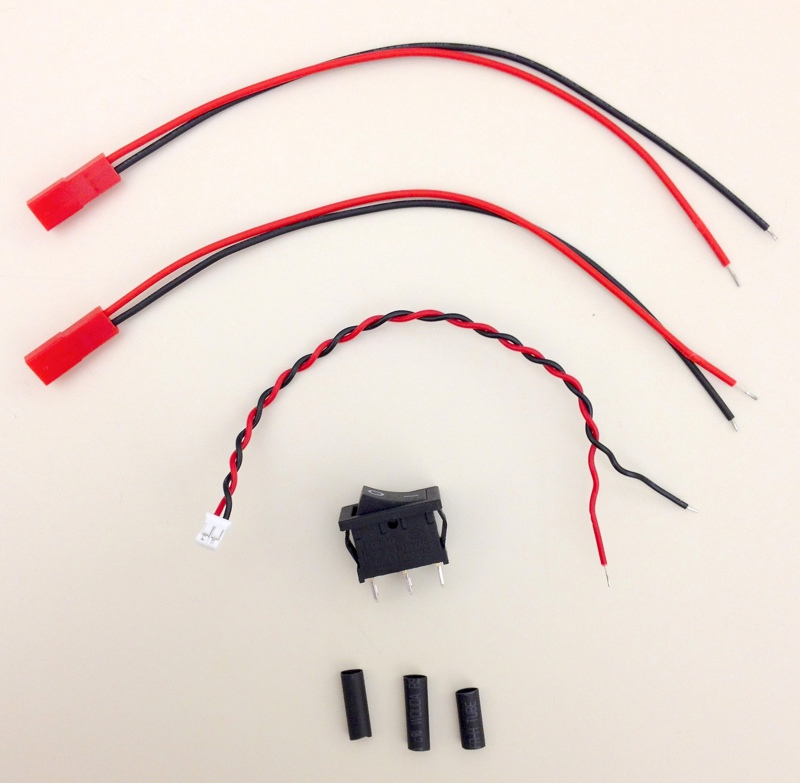
**Rocker Switch Wiring Parts**

 

**Tools**

0. Wire Strippers
0. Wire Cutters
0. Soldering Iron

**Instructions**

0. Cut battery connector wires to 3.5" and strip 1/4" from ends.
0. Twist stripped ends of black wires of battery connector together and twist stripped ends of red wires of battery connector together.
0. Insert black wires through one heat shrink tube and insert red wries through another one of the heat shrink tubes.
0. Untwist Uh-oh wire 1" and strip 1/4" from ends.
0. Insert red wire of Uh-oh connector through the last heat shrink tube.
0. Solder red wires of battery connectors to the pin on the "O" side of switch.
  * **Pro tip:** Solder wires together first, then solder to the pin of the switch.
0. Solder red wire of Uh-oh connector to the middle pin of the switch.
0. Solder all black wires together.
0. Heat shrink the tubing around solder points.

    {:.img_width_300}
    
    **Rocker Switch Wiring Assembly**

     

<!--  -->

# 2. DC Plug Wiring Assembly

**Number to build: 1**

**Parts**

0. 2 - 2-pin Female 0.1in-pitch JST Volt Reg Connector
0. 1 - 2-pin Female 2mm-pitch JST Uh-oh Connector
0. 1 - DC Barrel Plug

{:.img_width_300}
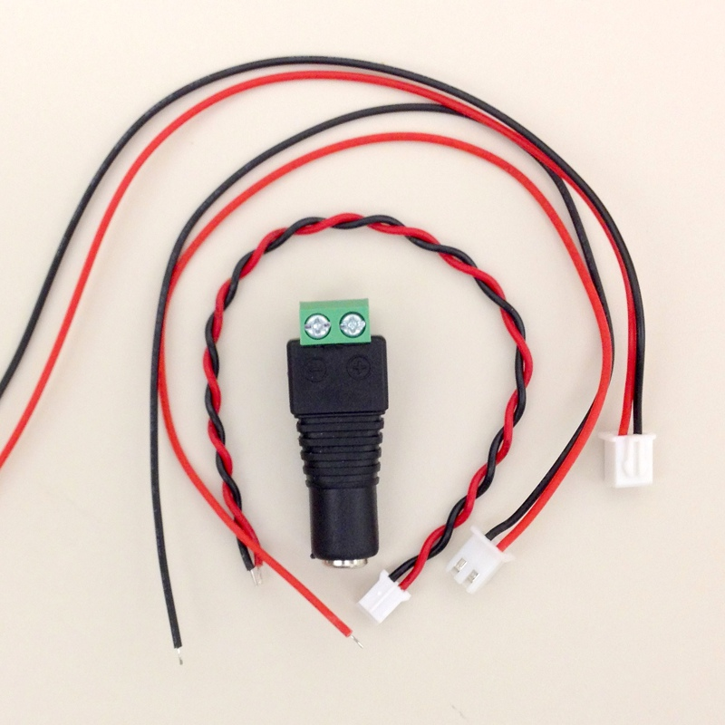
**DC Plug Wiring Parts**

 

**Tools**

0. Wire Strippers
0. Wire Cutters
0. Small Screw Driver

**Instructions**

0. Strip all wires 1/4" from end.
0. Twist all 3 black wires together and screw into negative terminal of DC plug.
0. Twist all 3 red wires together and screw into positive terminal of DC plug.

    {:.img_width_300}
    
    **DC Plug Wiring Assembly**

     

<!--  -->

<!-- # Power Supply Assembly

**Number to build: 1**

**Parts**

0. 1 - Rocker Switch Wiring Assembly
0. 1 - DC Plug Wiring Assembly
0. 1 - Uh-oh battery indicator Board Kit

**Tools**

0. Soldering Iron
0. Solder
0. Small Screw Driver

**Instructions**

0. Solder on all components to Uh-oh battery indicator board.
0. Adjust Uh-oh battery indicator board to 11V and label.
0. Adjust one voltage regulator to 5V and label.
0. Adjust one voltage regulator to 9V and label.
0. Plug rocker switch wiring assembly into "Batt" on Uh-oh battery indicator board.
0. Plug DC plug wiring assembly into "Sys" on Uh-oh battery indicator board.
0. Plug large JST plugs into "IN" on voltage regulators.

    {:.img_width_300}
    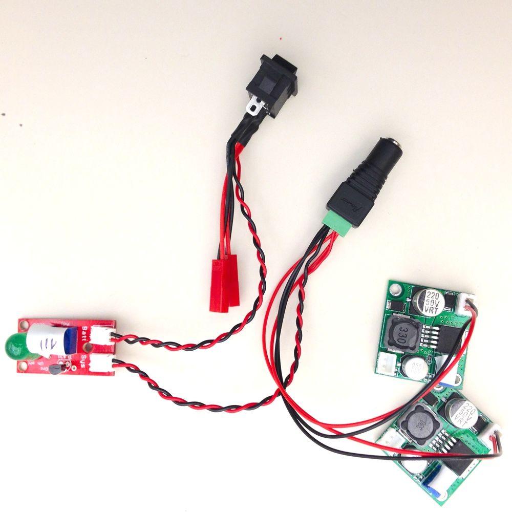

      -->

<!--  -->

# 3. Encoder Cable Assembly

**Number to build: 2**

**(1 with purple/gray ribbon and 1 with red/orange ribbon)**

**Parts**

0. 1 - Encoder Ribbon Cable
0. 5 - Female Molex Crimp Pins
0. 1 - 5-pin Molex Header
0. 2 - 1x2-pin 0.1" Crimp Connector Housing
0. 1 - 1x1-pin 0.1" Crimp Connector Housing
0. 5 - 0.1" Male Crimp Pins

{:.img_width_300}

**Encoder Cable Parts**

 

**Tools**

0. Wire Strippers
0. Wire Cutters
0. Crimpers
0. Needle Nose Pliers

**Instructions**

0. Separate 3/4" of the ribbon cable in to individual wires.
0. Strip 1/8" of insulation from each wire and twist ends so they are not frayed.
0. Crimp female Molex crimp pin to each wire.
  * **Note:** Make sure to crimp pin in correct orientation.**

    {:.img_width_300}
    

    {:.img_width_300}
    

     

0. Separate 3/4" of the other end of the ribbon cable into individual wires.
0. Strip 1/8" of insulation from each wire and twist ends so they are not frayed.
0. Crimp 0.1" male crimp pin to each wire.
0. Insert white & gray or yellow & orange wires into 1x2 0.1" crimp connector housing.
0. Insert black & blue or green & brown wire into 1x2 0.1" crimp connector housing.
0. Insert purple or red into 1x1 0.1" crimp connector housing.

    {:.img_width_300}
    
    **Encoder Cable Assembly**

     

<!--  -->

# 4. IR Cable Assembly

**Number to build: 5**

**Parts**

0. 1 - 3-pin Female 2mm-pitch JST IR Sensor Connector
0. 1 - 1x2-pin 0.1" Crimp Connector Housing
0. 1 - 1x1-pin 0.1" Crimp Connector Housing
0. 3 - 0.1" Male Crimp Pins

{:.img_width_300}

**IR Cable Parts**

 

**Tools**

0. Wire Strippers
0. Wire Cutters
0. Crimpers
0. Needle Nose Pliers

**Instructions**

0. Cut connector wires to 7" and strip off 1/8" of insulation from the ends.
0. Crimp on crimp pins to each wire end.
0. Insert red and black wires into 1x2-pin connector housing.
0. Insert white wire into 1x1-pin connector housing.

    {:.img_width_300}
    
    **IR Cable Assembly**

     

<!--  -->

# 5. IR Sensor Assembly

**Number to build: 5**

**Parts**

0. 1 - IR Sensor
0. 2 - 1/4" 4-40 Screws
0. 2 - 4-40 Angle Brackets

{:.img_width_300}

**IR Sensor Parts**

 

**Tools**

0. Small Screw Driver

**Instructions**

0. Insert the screws through IR sensor holes and into the threaded hole of the angle bracket with the angle bracket on the backside of the IR sensor.

    {:.img_width_300}
    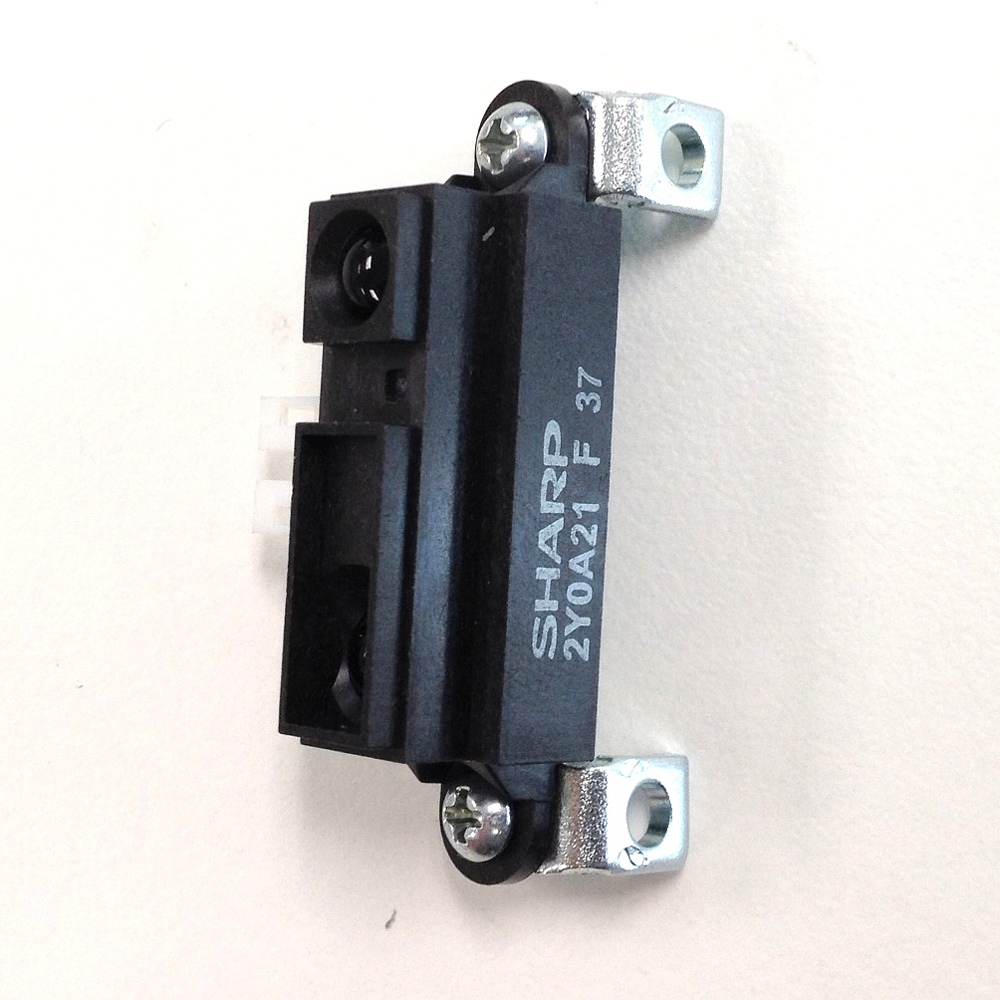
    **IR Sensor Assembly**

     

<!--  -->

# 6. Logic Level Converter Assembly

**Number to build: 1**

**Parts**

0. 1 - Logic Level Converter Board
0. 2 - 6-pin Male Breakaway Header Pins

{:.img_width_300}
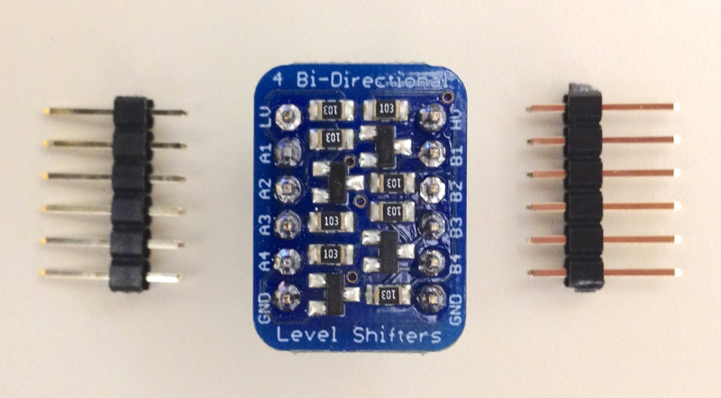
**Logic Level Converter Parts**

 

**Tools**

0. Soldering Iron
0. Solder

**Instructions**

0. Solder header pins to the board.
  * **Note:** The black portion of the header pins sits flush against the bottom of the board.
  * **Pro Tip:** Place header pins into a breadboard for easy soldering.

    {:.img_width_300}
    
    **Logic Level Converter Assembly**

     

<!--  -->

# 7. Breadboard Assembly

**Parts**

0. 1 - Logic Level Converter Assembly
0. 1 - Breadboard
0. 1 - H-Bridge
0. 7 - 4/10" Breadboard Jumper Wires (orange)
0. 5 - 5/10" Breadboard Jumper Wires (yellow)
0. 5 - 20k Ohm Resistors (red-black-orange-gold)
0. 5 - 10k Ohm Resistors (brown-black-orange-gold)

{:.img_width_300}

**Breadboard Parts**

 

**Instructions**

0. Instal all components onto breadboard as shown in the image.

    {:.img_width_300}
    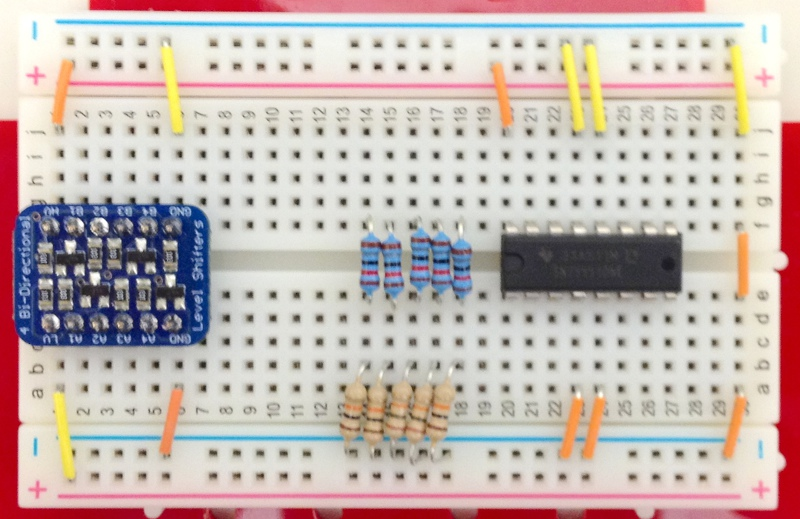
    **Breadboard Assembly**

     

<!--  -->

# 8. Motor-Encoder Assembly

**Number to build: 2**

**Parts**

0. 1 - Encoder Disc Sticker
0. 1 - Speed Board Disc
0. 1 - Wheel Encoder
0. 1 - Motor

{:.img_width_300}

**Breadboard Parts**

 

**Tools**

0. Drill
0. 9/64 Drill Bit

**Instructions**

0. Stick encoder disc sticker onto wheel encoder disc.
  * **Note:** Make sure to place directly in the center of the disc!
0. Enlarge wheel encoder mounting holes using approximately a 9/64 drill bit.

    {:.img_width_300}
    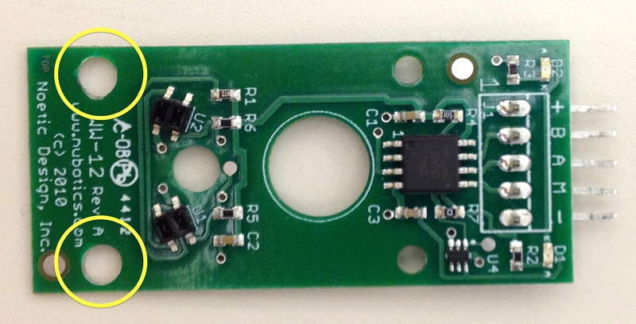
    **Encoder Holes to Enlarge**

     

0. Fit wheel encoder onto motor using round notch as an alignment guide.
0. Slide disc with sticker on to motor axle with the sticker facing the encoder. Keep disc flush with the end of the motor axle.

    {:.img_width_300}
    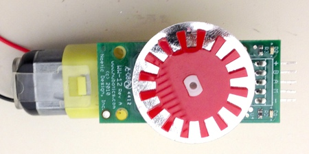
    **Motor-Encoder Assembly**

    {:.img_width_300}
    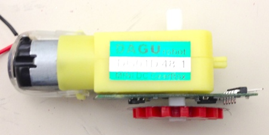

     

<!--  -->

# 9. Bottom Chassis With Motors Assembly

**Number to build: 1**

**Parts**

0. 2 - Motor-Encoder Assembly
0. 1 - Bottom Chassis Plate
0. 4 - Motor Holders (2 modified, 2 normal)
0. 4 - M3*30 Screw
0. 4 - M3 Nut

{:.img_width_300}
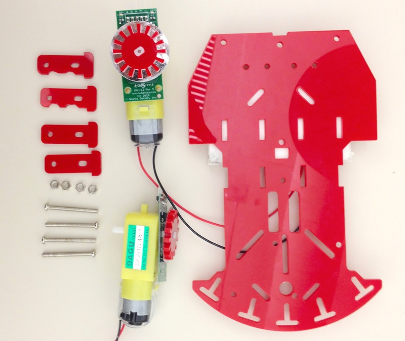
**Bottom Chassis With Motors Parts**

 

**Tools**

0. Drill
0. Dremel
0. Small Screw Driver

**Instructions**

0. Drill four holes towards the front of the bottom chassis plate as shown in the picture.
These holes are for mounting the voltage regulators, so use the voltage regulators as a guild for the placement of the holes.

    {:.img_width_300}
    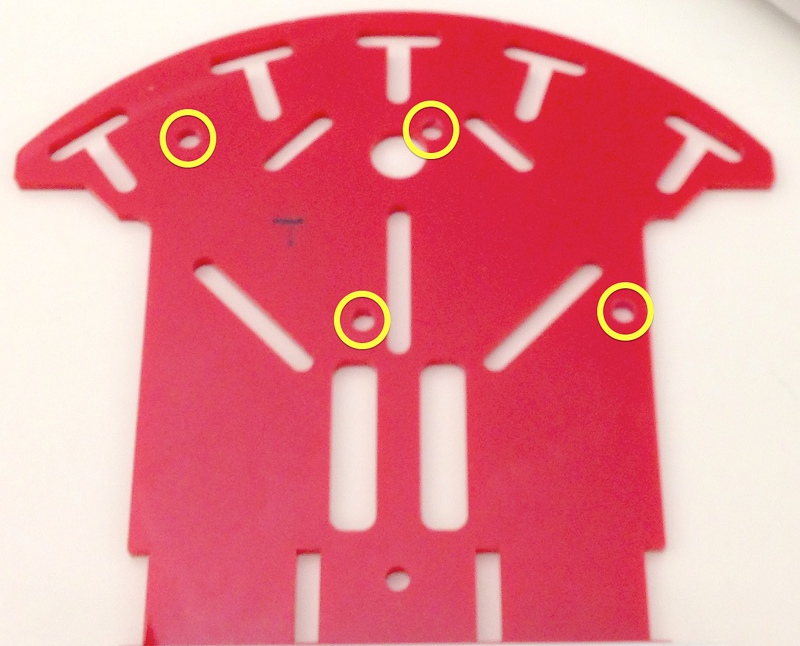
    **Voltage Regulator Holes on the Topside Bottom Chassis**

     

0. Modify the motor holders as shown in the picture. This allows for the encoder to fit with the motor holders, so use the motor-encoder assembly as a guild.

    {:.img_width_300}
    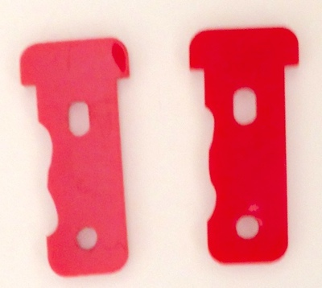
    **Modified Motor Holders**

     

    {:.img_width_300}
    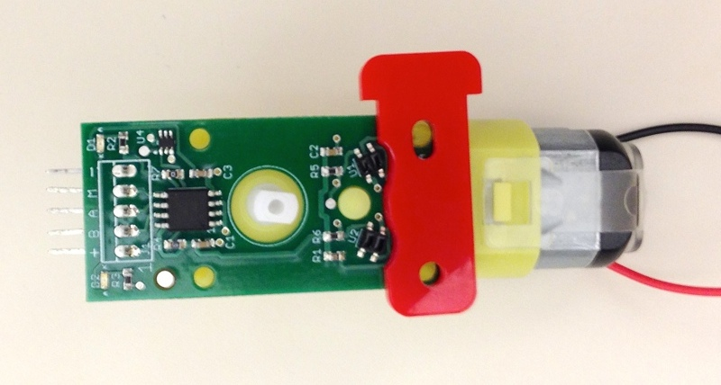

     

0. Place modified motor holders through slots in the bottom chassis plate, orientated such that modified edge of motor holders are on the front side of chassis (rounded edge).
The mounts should stick out towards the bottom of the bottom chassis.

    {:.img_width_300}
    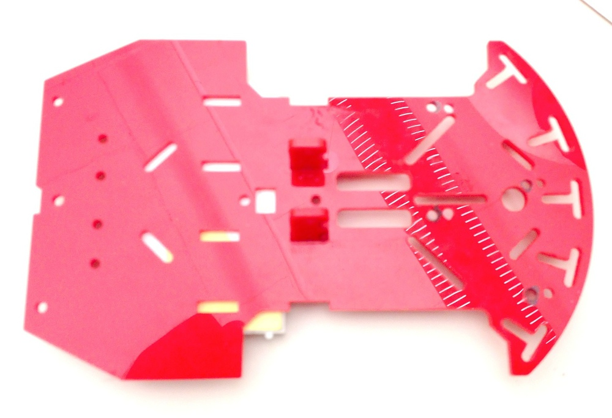

     

0. Install motor-encoder assembly with the other unmodified motor holder, two M3*30 screws, and two M3 nuts per motor with black wires of motors away from chassis.

    {:.img_width_300}
    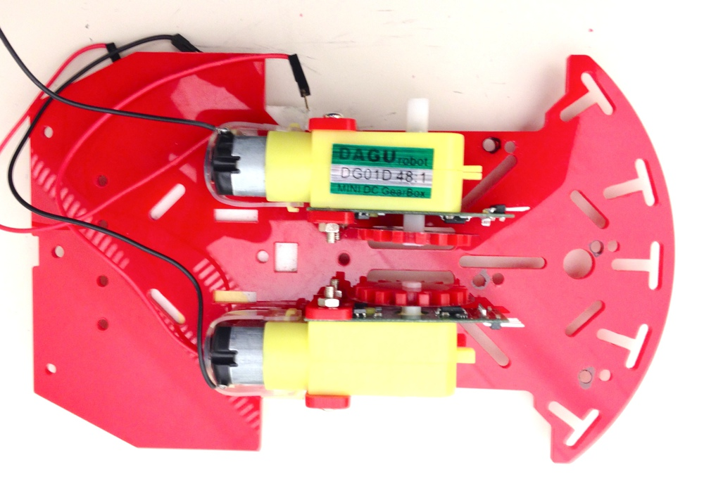
    **Bottom Chassis With Motors Assembly**

     

# 10. Bottom Chassis With Wheels Assembly

**Parts**

0. 1 - Bottom Chassis With Motors Assembly
0. 2 - Wheel
0. 1 - Omni Wheel
0. 4 - M3*6 Screw
0. 2 - L25 Spacer

{:.img_width_300}
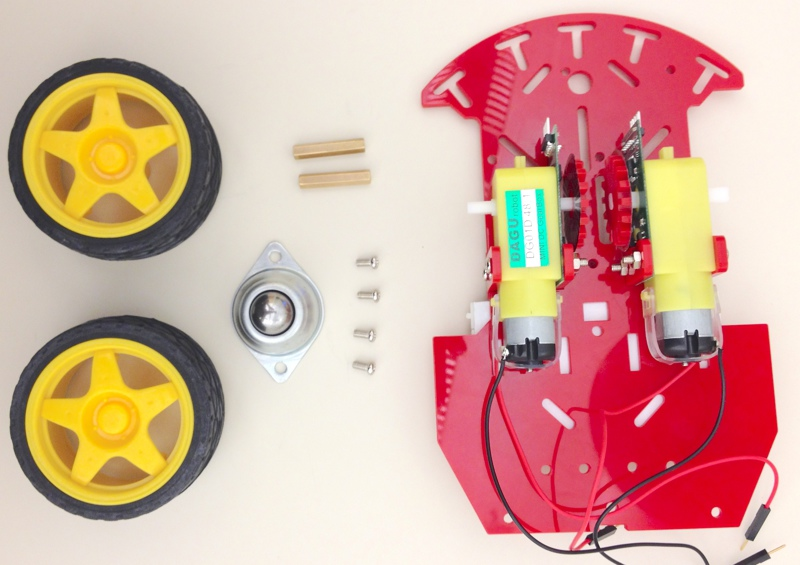
**Bottom Chassis With Wheels Parts**

 

**Tools**

0. Small Screw Driver

**Instructions**

0. Slide wheels onto motor axels.
0. Screw two L25 spacers onto the omni wheel.
0. Screw omni with spacers onto the bottom back (flat edge) of chassis assembly.

    {:.img_width_300}
    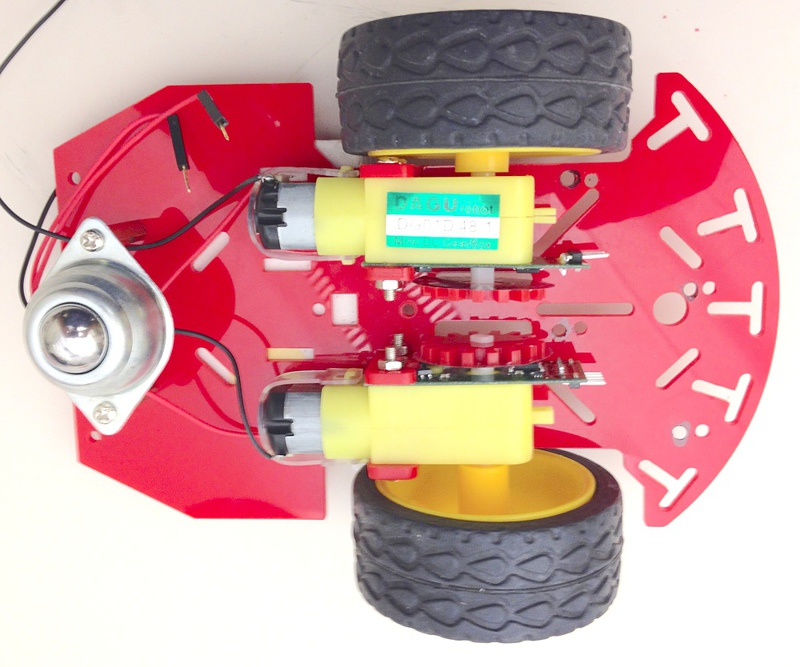

     

<!--  -->

# 11. Bottom Chassis With Voltage Regulators Assembly

**Number to build: 1**

**Parts**

0. 1 - Bottom Chassis With Motors Assembly
0. 1 - Breadboard Assembly
0. 2 - Voltage Regulators
0. 4 - 1/2" 4-40 Screw
0. 8 - 4-40 Nut

{:.img_width_300}

**Bottom Chassis With Voltage Regulators Parts**

 

**Tools**

0. Small Screw Driver

**Instructions**

0. Insert screws into voltage regulator holes and secure with nuts.

    {:.img_width_300}
    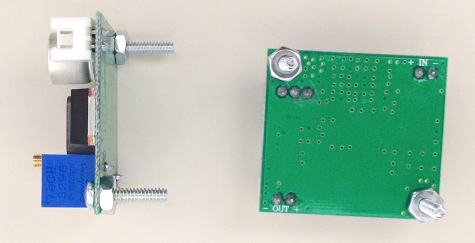
    **Voltage regulators with Screws**

     

0. Add voltage regulators to top and front of chassis assembly.
With each screw use one nut as a spacer between the voltage regulator and the chassis and one nut to secure the screw from the underside of the chassis.
0. Stick on breadboard to top of the bottom chassis.
Make sure to have it flush against the motor mounts and omni wheel screws.

    {:.img_width_300}
    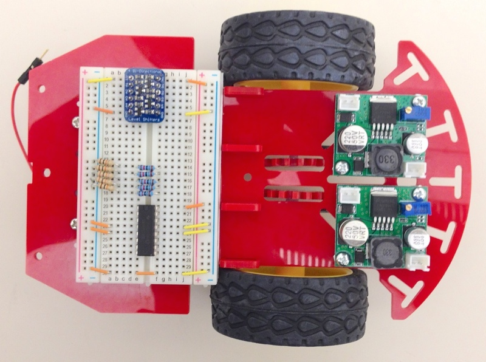
    **Bottom Chassis With Voltage Regulators Assembly**

     

<!--  -->

# Bottom Chassis With IR Sensors Assembly

**Number to build: 1**

**Parts**

0. 1 - Bottom Chassis With Voltage Regulators
0. 2 - IR Sensor Assembly
0. 4 - 1/2" 4-40 Screw
0. 4 - 4-40 Nut
0. 4 - L25 Spacer
0. 4 - M3 Nut

**Tools**

0. Small Screw Driver

**Instructions**

0. Add IR sensors to front of bottom chassis.
0. Mount L25 spacers to four corners of bottom chassis.

    {:.img_width_300}
    

     

<!--  -->

# 13. Top Chassis Plate Assembly

**Number to build: 1**

**Parts**

0. 3 - IR Sensor Assembly
0. 1 - Power Supply Assembly
0. 1 - Top Chassis Plate
0. 8 - 1/2" 4-40 Screw
0. 10 - 4-40 Nut
0. 3 - Zip Ties
0. 4 - L10 Spacer
0. 4 - M3 Screw

**Tools**

0. Small Screw Driver

**Instructions**

0. Add L10 spacers to top plate.

    {:.img_width_300}
    

    {:.img_width_300}
    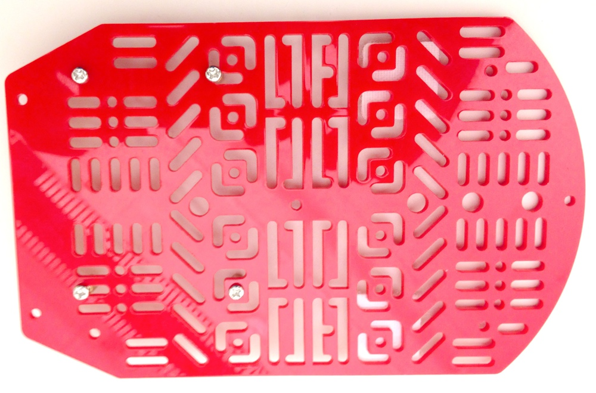

     

0. Add Uh-oh board to top plate.
0. Zip tie on switch and DC plug to front of plate.

    {:.img_width_300}
    

     

0. Add three IR sensors assemblies to top of plate.

    {:.img_width_300}
    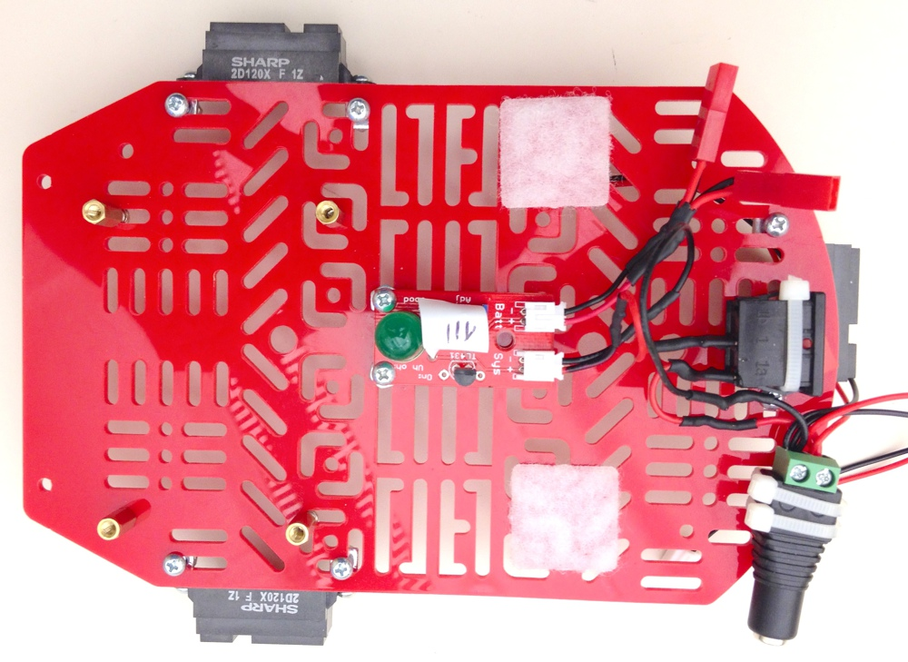

    {:.img_width_300}
    

     

# Top Chassis Plate With BBB Assembly

**Number to build: 1**

**Parts**
0. Top Chassis Plate Assembly
0. BeagleBone Black
0. 4 - M3 Screw

**Tools**

0. Small Screw Driver

**Instructions**

0. Attach BeagleBone Black to top plate with Ethernet port sticking out to the right.

# QuickBot Assembly

**Number to build: 1**

**Parts**

0. 1 - Bottom Chassis With IR Sensors Assembly
0. 1 -Top Chassis Plate With BBB Assembly
0. 4 - M3 Screw

**Tools**

0. Small Screw Driver

**Instructions**

0. Attach top plate assembly to bottom plate assembly.

    {:.img_width_300}
    

     

<noscript>Please enable JavaScript to view the <a href="http://disqus.com/?ref_noscript">comments powered by Disqus.</a></noscript>
<a href="http://disqus.com" class="dsq-brlink">comments powered by Disqus</a>

