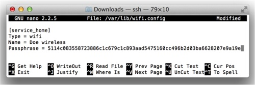
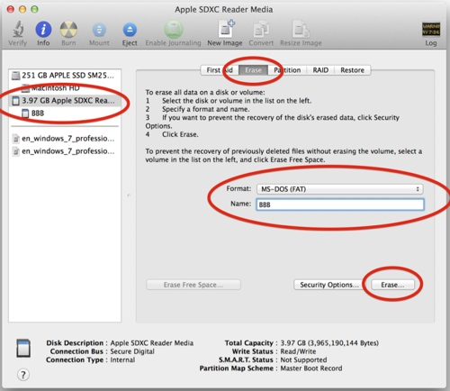
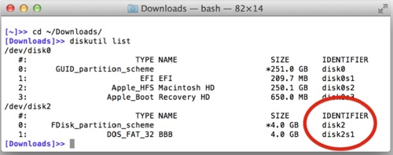
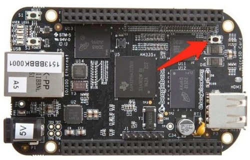

---
# <!-- Do not edit below -->
layout: robot
# <!-- Do not edit above -->

publish: true
priority:

title: QuickBot MOOC v2 -- Configuring
modified: 2014-06-02
image:
prev_name: Building
prev_link: building.html
next_name: Running
next_link: running.html
---

* Table of Contents
{:toc}

<!--  -->

# 1. SSH Into BeagleBone Black (BBB)

Adafruit has a great tutorial on how to SSH into the BBB over USB at

[https://learn.adafruit.com/ssh-to-beaglebone-black-over-usb/overview](https://learn.adafruit.com/ssh-to-beaglebone-black-over-usb/overview)

So, navigate to this page and follow the tutorial to SSH into your BBB via USB.

* If you get an error that says, `WARNING: REMOTE HOST IDENTIFICATION HAS CHANGED!` when you try to SSH into the BBB, don't worry.
This just means you are using two or more BBB with your computer.
To fix this error you need to delete the line with your BBB IP address (`192.168.7.2`) from the file SSH know hosts file (`~/.ssh/know_hosts`), which can be done with any text editor.
After that modification, you will be able to SSH into the BBB.

# 2. Set the Time on the BBB Manually

For your BBB to operate correctly it needs to have the correct time.
You can check the time with the `date` command.

First, you need to set the time zone that you are in.
The command you will use is similar to this one

    >> ln -sf /usr/share/zoneinfo/America/New_York /etc/localtime

Make sure to change the `America/New_York` to the major city in your time zone.
You can see which city to use with

    >> ls /usr/share/zoneinfo

Since, your BBB is not connected to the internet yet you will have to set the time manually.
The command to set the time looks like this

    >> date -s "1 JUN 2014 15:30:45"

So, use this command to set the time with your current local time.
Then test to see that it worked with just `>> date`.

# 3. Configure the Wifi

To make sure the BBB gets enough power and that the clock does not get reset it needs to be powered by the 5V DC power supply for the following steps.

Plug in your Wifi adapter and restart your BBB with this command:

    >> reboot

(You should see the green lights on the Wifi adapter turn on when your BBB starts back up.)

Once your BBB reboots, SSH back into it.
Check that your BBB recognizes the Wifi adapter with the following command:

    >> ifconfig ra0

If you don't get an error, then it is working.
If you do get an error try rebooting the BBB again.

To configure your Wifi settings (assuming you are using WPA encryption) do the following command,

    >> wpa_passphrase "YOUR NETWORK NAME HERE" 'YOUR NETWORK PASSWORD HERE'

For example:

Now, edit the Wifi configuration file at `/var/lib/connman/wifi.config` with the following:

    >> nano /var/lib/connman/wifi.config

    [service_home]
    Type = wifi
    Name = YOUR NETWORK NAME HERE
    Passphrase = YOUR ENCRYPTED PASSPHRASE HERE

(Use `ctrl-x`, `y`, `enter` to save and exit the nano text editor)

For example:

Reboot the BBB (`>> reboot`) and SSH back in.
Then check to see if you have a wifi IP address with

    >> ifconfig ra0 | grep "inet addr"

Also, check that you are connected to the internet with

    >> ping -o www.google.com

If you get 0% packet loss then you are good.

# 4. Configure Time to Set Via the Internet

Let's set the BBB to set its time automatically using the internet with the following commands:

    >> ntpdate -b -s -u pool.ntp.org
    >> /usr/lib/connman/test/set-global-timeservers pool.ntp.org

# 5. Install Necessary Libraries

There a few Python libraries that need to be installed.
Run the following commands:

    >> opkg update
    >> opkg install python-pip python-setuptools python-smbus
    >> pip install Adafruit_BBIO pyserial

If you get any errors check to see that your date is set correctly.

# 6. Configure Git

All the code for the QuickBot lives on a Git repository, but before you can clone the repository you need to configure Git.
To do this edit the `~/.gitconfig` file with the following:

    >> nano ~/.gitconfig

    [user]
        name = YOUR FULL NAME HERE
        email = YOUR EMAIL ADDRESS HERE
    [http]
        sslVerify = false
    [push]
        default = current

Optionally you can add some additional configuration to the end of the file that make Git a little nicer to work with.

    [color]
        ui = true
        branch = auto
        diff = auto
        interactive = auto
        status = auto
    [alias]
        co = checkout
        br = branch
        ci = commit
        st = status
        unstage = reset HEAD --
        untrack = rm --cached --
        discard = checkout --
        last = log -1 HEAD
        visual = !gitk

The color options give Git some colorful output and the alias are shortcut commands so you don't have to type those tediously long commands.

### 6a. Optional Configurations

If you would like your shell prompt to look a little nicer and want to Git to do some auto-completion then do the following:

Download Git auto-completion script with your local machine and move to BBB.

0. Open new terminal window
0. Run this command:
  * `>> wget "https://raw.githubusercontent.com/git/git/master/contrib/completion/git-completion.bash" git-completion.bash`
  * If you don't have `wget` on your computer you can install with Homebrew, MacPorts, or from source following these instructions "[Install wget in Mac OS X Without Homebrew or MacPorts](http://osxdaily.com/2012/05/22/install-wget-mac-os-x/)"
  * If you get an error you with the `wget` command may need to use the `--no-check-certificate` option.
0. Copy this file to the BBB home directory with this command:
  * `>> scp git-completion.bash root@192.168.7.2:/home/root/`
0. Remove file from local machine
  * `>> rm git-completion.bash`
0. Change back to BBB terminal window
0. Move script to `~/.gitscripts` folder with these commands:
  * `>> mkdir ~/.gitscripts`
  * `>> mv ~/git-completion.bash ~/.gitscripts`

Edit `~/.profile` to load `git-completion.bash` script and add some additional goodies with the following:

    >> nano ~/.profile

    # Setting command prompt and other command colors
    PS1='\[\e[1;34m\][\u@\h \W]>>\[\e[0m\] '
    alias ls='ls -G'
    export CLICOLOR=1
    export LSCOLORS=Gxfxcxdxbxegedabagacad
    alias ll='ls -lah'
    alias grep='grep --color=auto'

    # Setting variables
    export SLOTS=/sys/devices/bone_capemgr.8/slots
    export PINS=/sys/kernel/debug/pinctrl/44e10800.pinmux/pins
    export GPIO=/sys/class/gpio

    # Source scripts
    source ~/.gitscripts/git-completion.bash

Apply the new configuration with:

    >> source ~/.profile

# 7. Get the Git Repository and Set It Up

Get the code with:

    >> cd ~
    >> git clone https://github.com/o-botics/quickbot_bbb.git

# 8. Set the Serial Setup Script to Run on Startup

There is a script that needs to run each time the BBB boots up to set up the serial devices.
You can run this script manually with

    >> cd ~/quickbot_bbb/serial
    >> ./setup.sh

But it is nice if this happens automatically on boot up.
Create a service file and add the following:

    >> nano /lib/systemd/system/serialsetup.service

    [Unit]
    Description=Sets up serial devices for BBB.
    After=syslog.target network.target

    [Service]
    Type=simple
    ExecStart=/home/root/quickbot_bbb/serial/setup.sh

    [Install]
    WantedBy=multi-user.target

Make a symbolic link to the service file:

    >> ln -s /lib/systemd/system/serialsetup.service /etc/systemd/system/serialsetup.service

Active the service:

    >> systemctl daemon-reload
    >> systemctl start serialsetup.service
    >> systemctl enable serialsetup.service

Next time your BBB the serial devices will be setup automatically, but now you can just setup them up manually.

Now your BBB is all setup to run the code.

# A. Optional

### Setup ability to SSH into BBB with IP address and no password

It is annoying having to type `ssh root@192.168.7.2` then wait to enter for at the password prompt in order to log into the BBB.
To simplify things you can setup an SSH key so you can just type something like `ssh bbb`.

On your local machine create an SSH key with the following:

    (If you do not already have a ~/.ssh folder)
    >> mkdir ~/.ssh
    >> chmod 700 ~/.ssh
    (If you already have a ~/.ssh folder)
    >> cd ~/.ssh

    (If you do not already have a public key)
    (Hit enter to keep all default options with no password)
    >> ssh-keygen -t rsa

    >> scp ~/.ssh/id_rsa.pub root@192.168.7.2:/home/root
    >> nano config

    Host bbb
        HostName 192.168.7.2
        User root
        IdentityFile ~/.ssh/id_rsa

SSH into the BBB with the normal `ssh root@192.168.7.2`

    >> mkdir -p ~/.ssh
    >> cat ~/id_rsa.pub >> ~/.ssh/authorized_keys
    >> rm id_rsa.pub
    >> chmod 600 ~/.ssh/authorized_keys
    >> chmod 700 ~/.ssh

Log out of BBB with `crtl-D` or `>> exit` and log back in with

    >> ssh bbb

Easy!

# B. Troubleshooting

If things are working like I make them out to work above try the following.

### Flash Latest Angstrom OS onto the BBB

**1. Download BeagleBone Black (eMMC flasher) from the BBB website:**

[http://beagleboard.org/latest-images/](http://beagleboard.org/latest-images/)

**2. Flash image onto microSD card**

_(Mac Version to flash image onto microSD card)_

* Plug the microSD card into computer and open “Disk Utility.app” (/Applications/Utilities/Disk Utility.app)

* Select the mircoSD card in left column and click the “Erase” tab.
* Set the format to MS-DOS (FAT), name “BBB”, and click “Erase…” button.

* Extract “BBB­eMMC­flasher­2013.09.04.img” from archived file in “Downloads” folder.
* Open Terminal.app (/Applications/Utilities/Terminal.app) and enter the following
commands:

    `>> cd ~/Downloads`

    `>> diskutil list`

* Look for the “BBB” disk number. (In the image the disk number is 2).

* Enter the following commands into the terminal:

    `>> diskutil unmountDisk /dev/disk#`

    (Use the disk number you found from above instead of the # symbol)

    `>> sudo dd bs=2m if=BBB­eMMC­flasher­2013.09.04.img of=/dev/rdisk#`

    (Notice that there is an “r” front of disk. Also, again use the disk # number from above.)

* Enter your password and wait 15­30 minutes. Note: the operation gives no feedback until it is done.
* Eject disk from computer.

        >> diskutil eject /dev/disk#

**3. Flash microSD card to BBB**

* Power down and unplug BBB.
* Insert microSD card into BBB.
* Hold down the “User Boot” button (see image below) while powering up the BBB
(USB or 5V adaptor).
* Continue to hold button until all 4 LEDs begin to flash then release the button.
* Wait ~1-­2 hours until all 4 LEDs are lit up at the same time.
* Power down BBB.
* Remove microSD card.

<!-- Do not edit below this line -->

<noscript>Please enable JavaScript to view the <a href="http://disqus.com/?ref_noscript">comments powered by Disqus.</a></noscript>
<a href="http://disqus.com" class="dsq-brlink">comments powered by Disqus</a>
